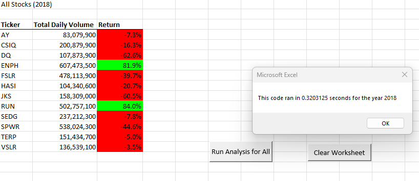

# VBA Challenge

## Overview of Project

### Purpose

We are asked to refactor VBA code and measure performance of our macros against stock data during 2017 and 2018. 

## Analysis

We started with a basic VBA script to run our analysis. This gave us information about the stock DQ. When determined that this stock was not performing well, we looked to run analysis against all the stocks from the data. We included custom formatting, header names, and nested loops to run across the entire spreadsheet in worksheet 2018. We also included a timer function to test how long our macro took to run.

link to the data file: [filename](/VBA_Challenge.zip)

The following was created from the vbs file that was imported to our VBA code.
	
	'Define the variables startTime and endTime
	 Dim startTime As Single
	 Dim endTime As Single`

I used an inputbox to prompt the user to enter the year they wanted the query.
	`yearValue = InputBox("What year would you like to run the analysis on?")`

The we had to format the output sheet on All Stock Analysis worksheet
	` Worksheets("All Stocks Analysis").Activate`

This was followed by:
	`Range("A1").Value = "All Stocks (" + yearValue + ")"`
This would query either worksheet based on the year entered.

The headers in the All Stock Analysis worksheet was labeled with the following:

'Create a header row
    Cells(3, 1).Value = "Ticker"
     Cells(3, 2).Value = "Total Daily Volume"
     Cells(3, 3).Value = "Return"

'Initialize array of all tickers
    Dim tickers(12) As String
    
    tickers(0) = "AY"
    tickers(1) = "CSIQ
    tickers(2) = "DQ"
    tickers(3) = "ENPH"
    tickers(4) = "FSLR"
    tickers(5) = "HASI
    tickers(6) = "JKS"
    tickers(7) = "RUN"
    tickers(8) = "SEDG"
    tickers(9) = "SPWR"
    tickers(10) = "TERP"
    tickers(11) = "VSLR"`

 The worksheet was activated with the following:
    `Worksheets(yearValue).Activate`
    
    'Get the number of rows to loop over
     RowCount = Cells(Rows.Count, "A").End(xlUp).Row

The first image was taken of the code run before refactoring. As you can see it took approximately 1.8 seconds to run data for 2018.

 

### Analysis after Refactoring

A VBS script file was provided and we needed to use it to refactor our VBA code. The goal of refactoring is to improve the performance of the code by eliminating the number of steps the code must take to complete. Removing the nested loops improved the code. 

Here is the code after refactoring:

  	'1a) Create a ticker Index
   		 tickerIndex = 0

  	'1b) Create three output arrays
     		Dim tickerVolumes(12) As Long
     		Dim tickerStartingPrices(12) As Single
     		Dim tickerEndingPrices(12) As Single
    
 	'2a) Create a for loop to initialize the tickerVolumes to zero.
     		For I = 0 To 11
        	  tickerVolumes(I) = 0
    
   	 Next I
        
 	'2b) Loop over all the rows in the spreadsheet.
     	 For I = 2 To RowCount`
            
  	'3a) Increase volume for current ticker
        tickerVolumes(tickerIndex) = tickerVolumes(tickerIndex) + Cells(I, 8).Value
        
   
  	'3b) Check if the current row is the first row with the selected tickerIndex.
        	If Cells(I - 1, 1).Value <> tickers(tickerIndex) And Cells(I, 1).Value = tickers(tickerIndex) Then
                tickerStartingPrices(tickerIndex) = Cells(I, 6).Value
        	End If
         
                   
  	'3c) Check if the current row is the last row with the selected ticker
           If the next Row's ticker doesn't match, increase the tickerIndex.
        
	     If Cells(I + 1, 1).Value <> tickers(tickerIndex) And Cells(I, 1).Value = tickers(tickerIndex) Then
                 tickerEndingPrices(tickerIndex) = Cells(I, 6).Value
    
        End If
        
    '3d) Increase the tickerIndex.
         If Cells(I + 1, 1).Value <> tickers(tickerIndex) And Cells(I, 1).Value = tickers(tickerIndex) Then
                tickerIndex = tickerIndex + 1
        
	  End If
             
    
        Next I
         
    
    '4) Loop through your arrays to output the Ticker, Total Daily Volume, and Return.
        For I = 0 To 11
        
        Worksheets("All Stocks Analysis").Activate
        Cells(4 + I, 1).Value = tickers(I)
        Cells(4 + I, 2).Value = tickerVolumes(I)
        Cells(4 + I, 3).Value = tickerEndingPrices(I) / tickerStartingPrices(I) - 1
      
    Next I
    
    Formatting
      Worksheets("All Stocks Analysis").Activate
      Range("A3:C3").Font.FontStyle = "Bold"
      Range("A3:C3").Borders(xlEdgeBottom).LineStyle = xlContinuous
      Range("B4:B15").NumberFormat = "#,##0"
      Range("C4:C15").NumberFormat = "0.0%"
      Columns("B").AutoFi

      dataRowStart = 4
      dataRowEnd = 15

   For I = dataRowStart To dataRowEnd
       
        If Cells(I, 3) > 0 Then
            
            Cells(I, 3).Interior.COLOR = vbGreen
            
        Else
        
            Cells(I, 3).Interior.COLOR = vbRed
            
        End If
      
      Next I
 
    	endTime = Timer
    	MsgBox "This code ran in " & (endTime - startTime) & " seconds for the year " & (yearValue)

  End Sub

I ran the code and as you can see it only tool .32 seconds to run the 2018 data. 

  

### Analysis of Stocks

Looking at 2018 stock data, only two stocks ENPH and RUN, had positive returns over 80%. The DQ stock had a -62% return.
In 2017, the majority of the stocks had positive returns including DQ.

### Challenges and Difficulties Encountered

Trying to avoid misplacing an incorrect synthax when you have long code was challenging, especially when dealing 'For loops. 

